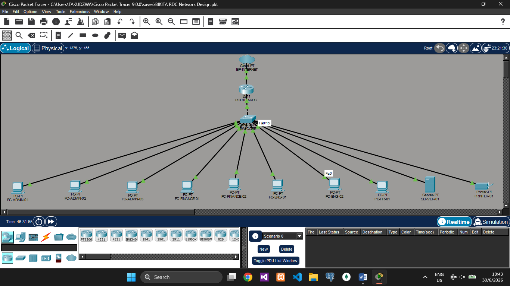

# Bikita RDC — Multi-Department Segmented LAN

> A Cisco Packet Tracer simulation of the network infrastructure I designed and supported during my internship at Bikita Rural District Council (2023–2024), rebuilt with formal VLAN segmentation, ACL security policies, DHCP, DNS, NAT, and documented IP address management.



---

## Background

During my internship as IT Systems Officer at Bikita Rural District Council, I was the sole IT professional supporting 8 departments and approximately 20–25 staff. One of the infrastructure gaps I identified was a flat, unsegmented LAN — all departments shared the same network, meaning Finance workstations had direct layer-2 visibility to HR/Payroll systems and vice versa, with no enforced access controls between them.

This project rebuilds that environment in Cisco Packet Tracer with the segmentation and security controls I proposed and partially implemented, extended into a fully documented simulation suitable for demonstration and learning.

---

## Network Overview

| Parameter | Value |
|---|---|
| Topology | Router-on-a-stick + Layer 3 core switch |
| VLANs | 6 (Administration, Finance, Engineering, HR/Payroll, Servers/IT, Management) |
| Routing | Inter-VLAN via router subinterfaces + L3 switch SVIs |
| DHCP | Centralised on router — one pool per VLAN |
| DNS | SERVER-01 at 192.168.50.2 |
| Internet Access | NAT overload (PAT) on WAN interface |
| Security | Extended ACLs enforcing department isolation |
| Simulation Tool | Cisco Packet Tracer 8.2+ |

---

## Topology Diagram

```
                        ┌─────────────┐
                        │  ISP / WAN  │
                        │ 203.0.113.1 │
                        └──────┬──────┘
                               │ Gi0/1 — WAN (203.0.113.2)
                        ┌──────┴──────┐
                        │ ROUTER-RDC  │  ← NAT, DHCP, ACLs, subinterfaces
                        │  ISR 4321   │
                        └──────┬──────┘
                               │ Gi0/0 — TRUNK (all VLANs)
                        ┌──────┴──────┐
                        │   SW-CORE   │  ← VLAN segmentation, port assignment
                        │  3560-24PS  │
                        └──┬──┬──┬──┬─┘
                           │  │  │  │
              ┌────────────┘  │  │  └────────────────┐
              │               │  │                    │
         VLAN 10         VLAN 20  VLAN 30        VLAN 40    VLAN 50
       Administration    Finance  Engineering   HR/Payroll  Servers/IT
       (Fa0/1–Fa0/8)  (Fa0/9–13)(Fa0/14–18)  (Fa0/19–22) (Fa0/23–24)
       3 workstations  2 PCs     2 PCs          1 PC       SERVER-01
                                                           PRINTER-01
```

---

## IP Address Plan

### Subnet Allocation (VLSM)

| VLAN | Department | Network | Mask | Gateway | Usable Hosts | DHCP Range |
|------|------------|---------|------|---------|--------------|------------|
| 10 | Administration | 192.168.10.0 | /26 | 192.168.10.1 | 62 | .11 – .62 |
| 20 | Finance | 192.168.20.0 | /27 | 192.168.20.1 | 30 | .6 – .30 |
| 30 | Engineering | 192.168.30.0 | /27 | 192.168.30.1 | 30 | .6 – .30 |
| 40 | HR & Payroll | 192.168.40.0 | /28 | 192.168.40.1 | 14 | .6 – .14 |
| 50 | Servers / IT | 192.168.50.0 | /29 | 192.168.50.1 | 6 | Static only |
| 60 | Management | 192.168.60.0 | /30 | 192.168.60.1 | 2 | Static only |

### Static Host Assignments

| Device | VLAN | IP Address | Role |
|--------|------|------------|------|
| ROUTER-RDC | WAN | 203.0.113.2 | WAN interface |
| ROUTER-RDC | 10 | 192.168.10.1 | Admin gateway |
| ROUTER-RDC | 20 | 192.168.20.1 | Finance gateway |
| ROUTER-RDC | 30 | 192.168.30.1 | Engineering gateway |
| ROUTER-RDC | 40 | 192.168.40.1 | HR gateway |
| ROUTER-RDC | 50 | 192.168.50.1 | Server VLAN gateway |
| ROUTER-RDC | 60 | 192.168.60.1 | Management gateway |
| SW-CORE | 60 | 192.168.60.2 | Switch management SVI |
| SERVER-01 | 50 | 192.168.50.2 | DNS + HTTP server |
| PRINTER-01 | 50 | 192.168.50.3 | Network printer |

---

## Security Policy — Access Control Lists

The ACLs enforce department isolation based on data sensitivity and the principle of least privilege. All rules are applied as extended ACLs on the router's VLAN subinterfaces.

| Rule | Source | Destination | Action | Justification |
|------|--------|-------------|--------|---------------|
| 1 | Finance (VLAN 20) | HR/Payroll (VLAN 40) | **DENY** | Payroll data confidentiality — Finance has no operational need to access HR systems |
| 2 | HR/Payroll (VLAN 40) | Finance (VLAN 20) | **DENY** | Financial records protection — HR has no operational need to access Finance systems |
| 3 | Finance (VLAN 20) | Servers (VLAN 50) | **DENY** | Server administration is restricted to IT department only |
| 4 | HR/Payroll (VLAN 40) | Servers (VLAN 50) | **DENY** | Server administration is restricted to IT department only |
| 5 | Administration (VLAN 10) | Servers (VLAN 50) | **DENY** | Server administration is restricted to IT department only |
| 6 | WAN (any) | All LAN subnets | **DENY** | Block unsolicited inbound traffic from the internet |
| 7 | All VLANs | Internet (via NAT) | **PERMIT** | All departments require outbound internet access |

> **Design note:** The IT/Servers VLAN (50) acts as the only management plane. Only devices physically connected to VLAN 50 ports can administer the server — this mirrors role-based access control (RBAC) at the network layer, complementing OS-level access controls on the server itself.

---

## VLAN Port Assignment

| Switch Port(s) | VLAN | Department | Mode |
|----------------|------|------------|------|
| Fa0/1 – Fa0/8 | 10 | Administration | Access |
| Fa0/9 – Fa0/13 | 20 | Finance | Access |
| Fa0/14 – Fa0/18 | 30 | Engineering | Access |
| Fa0/19 – Fa0/22 | 40 | HR & Payroll | Access |
| Fa0/23 – Fa0/24 | 50 | Servers / IT | Access |
| Gi0/2 | 60 | Management | Access |
| Gi0/1 | All | Uplink to Router | Trunk |

---

## Verification Tests

The following tests confirm the topology is working as designed. Screenshots of each are in the `docs/` folder.

### Tests that should SUCCEED

```
PC-Admin-01   → ping 192.168.10.2    (same VLAN — intra-VLAN)          ✅
PC-Admin-01   → ping 192.168.30.1    (inter-VLAN routing working)       ✅
PC-Finance-01 → ping 192.168.20.1    (reaches own gateway)              ✅
PC-Admin-01   → ping 203.0.113.1     (NAT working — WAN reachable)      ✅
PC-Admin-01   → http://rdc-server.local  (DNS resolution working)       ✅
```

### Tests that should FAIL (ACL enforcement)

```
PC-Finance-01 → ping 192.168.40.6   (Finance → HR blocked)             ❌
PC-HR-01      → ping 192.168.20.6   (HR → Finance blocked)             ❌
PC-Finance-01 → ping 192.168.50.2   (Finance → Servers blocked)        ❌
PC-Admin-01   → ping 192.168.50.2   (Admin → Servers blocked)          ❌
```

---

## Repository Structure

```
rdc-network-design/
├── README.md                        ← this file
├── network-topology.pkt             ← Cisco Packet Tracer simulation file
├── docs/
│   ├── topology-diagram.png         ← full canvas screenshot
│   ├── vlan-config.png              ← show vlan brief output
│   ├── ping-success.png             ← inter-VLAN ping passing
│   ├── acl-block-demo.png           ← Finance → HR ping failing
│   └── simulation-mode.png          ← Packet Tracer simulation mode
└── configs/
    ├── ROUTER-RDC-config.txt        ← full router running config
    ├── SW-CORE-config.txt           ← full switch running config
    └── SERVER-config-notes.txt      ← server GUI configuration reference
```

---

## How to Open and Run This Project

1. Install [Cisco Packet Tracer](https://www.netacad.com/courses/packet-tracer) (free with a NetAcad account)
2. Clone or download this repository
3. Open `network-topology.pkt` in Packet Tracer
4. Switch to **Realtime mode** (clock icon, bottom right)
5. Click any PC → Desktop → Command Prompt and run the ping tests above
6. To rebuild from scratch, follow `RDC-Network-Build-Guide.docx` and paste the configs from the `configs/` folder

---

## Key Concepts Demonstrated

- **VLAN segmentation** — isolating departments at layer 2 to reduce broadcast domains and attack surface
- **VLSM subnetting** — right-sizing each subnet to the department's actual host count, avoiding address waste
- **Router-on-a-stick** — using dot1Q subinterfaces on a single physical link for inter-VLAN routing
- **Extended ACLs** — enforcing access control between VLANs based on source and destination IP
- **NAT overload (PAT)** — allowing all internal hosts to share a single public IP for internet access
- **Centralised DHCP** — one DHCP server (the router) managing address allocation across all VLANs with excluded ranges for static hosts
- **Static IP management** — assigning predictable addresses to infrastructure devices (server, printer, gateways)
- **DNS service** — name resolution for internal resources, eliminating IP dependency for end users
- **Principle of least privilege** — ACL design ensures each VLAN can only reach what it operationally needs

---

## Real-World Context

This simulation is directly based on experience at Bikita Rural District Council, where I managed approximately 30–35 IT assets and 20–25 user accounts across 8 departments. The ACL rules in this project reflect the data protection obligations under Zimbabwe's **Cyber and Data Protection Act (Chapter 12:07)**, which requires that personal data — including payroll and HR records — be protected against unauthorised access. Network-layer segmentation is the first line of defence for those controls.

---

## Author

**Takudzwa Manjonjo**
IT Systems Officer | Network & Infrastructure Specialist
📧 manjonjotakudzwa@gmail.com
🎓 BCom Honours, Information Systems — Midlands State University
🎓 MCom Information Systems Management (in progress) — Midlands State University

**Certifications:**
- Project Management Fundamentals — IBM SkillsBuild (Jun 2026)
- Networking Basics — Cisco Networking Academy (May 2026)
- Introduction to Cybersecurity — Cisco Networking Academy (Apr 2026)

---

## Topics

`cisco-packet-tracer` `networking` `vlan` `network-security` `acl` `dhcp` `subnetting` `nat` `dns` `local-government-it` `zimbabwe` `cybersecurity` `infrastructure`
